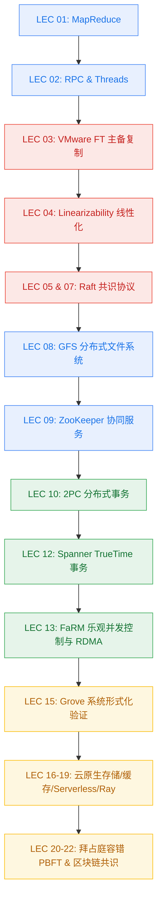

# 分布式系统精读笔记 (Distributed Systems Notes)

[](https://github.com/donkey-roll/distributed-system/actions/workflows/deploy-pages.yml)

基于 **MIT 6.5840 (原 6.824) Distributed Systems (Spring 2025)** 课程体系构建的机制级分布式系统精读笔记与知识库。

涵盖分布式系统的经典论文精读、状态机复制 (SMR)、一致性模型 (Linearizability)、共识算法 (Raft)、分布式事务 (2PC / OCC / Spanner TrueTime)、分布式缓存与大规模存储系统机制剖析，并配套 Mermaid 机制流转图与实验深入分析。

---

## 本地开发与预览 (Local Development)

### 1. 环境准备

推荐使用 Python 3.10+：

```bash
# 创建并激活虚拟环境
python3 -m venv .venv
source .venv/bin/activate

# 安装 MkDocs 与主题扩展依赖
pip install -r requirements.txt
```

### 2. 启动本地实时热重载服务

```bash
mkdocs serve
```

访问本地服务地址：`http://127.0.0.1:8000` 即可实时预览文档与 Mermaid 架构图。

### 3. 构建静态站点

```bash
mkdocs build --strict
```

生成静态 HTML 文件至 `site/` 目录。

---

## GitHub Pages 自动化部署

本项目通过 [`.github/workflows/deploy-pages.yml`](.github/workflows/deploy-pages.yml) 实现了基于 GitHub Actions 的全自动持续集成与部署：

1. 当代码推送到 `main` 分支或手动触发 `workflow_dispatch` 时，工作流自动运行。
2. 自动配置 Python 环境，安装 `requirements.txt` 依赖。
3. 执行 `mkdocs build --strict --site-dir site` 严格编译（任何失效死链或语法告警均会阻断并暴露问题）。
4. 自动上传静态站点产物并安全发布至 GitHub Pages。

> **提示**：在 GitHub 仓库的 **Settings → Pages** 中，将 **Build and deployment source** 切换为 **GitHub Actions**。

---

## 课程体系大纲 (Curriculum Roadmap)



详细内容目录请参阅在线文档或 `mkdocs.yml` 导航。
