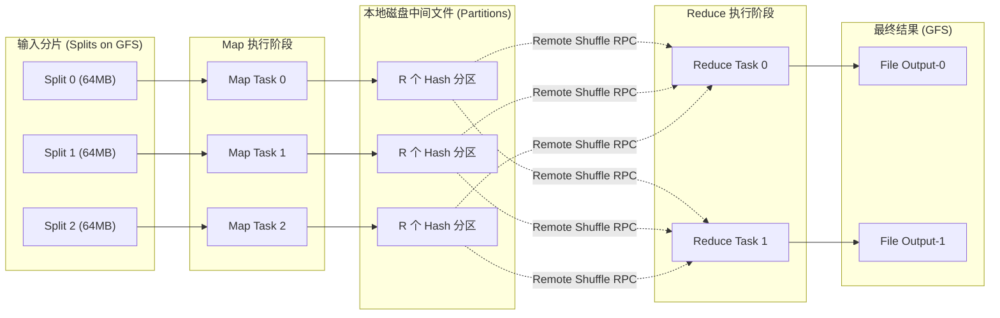

# LEC 01 - 分布式系统导论与 MapReduce

> **经典论文**：*MapReduce: Simplified Data Processing on Large Clusters* (Jeffrey Dean and Sanjay Ghemawat, Google Inc., OSDI 2004)  
> **核心主题**：分布式计算模型、Map/Reduce 抽象、故障自愈调度机制与数据局部性 (Data Locality)

---

## 1. 为什么需要分布式系统？

分布式系统 (Distributed Systems) 的本质是**通过多台普通商用计算机组成的网络集群，共同完成单台计算机物理极限无法支撑的存储与计算任务**。

推动分布式系统的三大核心物理驱动力：
1. **并行与扩展性 (Parallelism & Scalability)**：通过横向扩展 (Scale-Out) 实现算力与内存带宽线性增长。
2. **容错与高可用 (Fault Tolerance & Availability)**：任何单机故障不导致整体服务瘫痪。
3. **物理距离与低延迟 (Proximity)**：将数据缓存或处理分发到更靠近终端用户的地理区域。

分布式系统面临的物理本质困境：
- **独立故障 (Independent Failures)**：网络可能丢包、延迟激增、节点崩溃或断电。
- **并发与竞态 (Concurrency)**：跨节点协调顺序充满不确定性。
- **没有全局物理时钟**：无法简单依靠硬件时间戳判定分布式事件先后。

---

## 2. MapReduce 编程范式与数据流

Google 提出 MapReduce 的核心目的是：**让不熟悉分布式底层网络通信、容错恢复和竞态处理的普通算法工程师，也能轻松利用数千台集群服务器进行海量数据批处理。**

### 核心函数签名
- **Map**: $(k_1, v_1) \to \text{list}(k_2, v_2)$
  - 读取输入键值对，生成一系列中间键值对。
- **Reduce**: $(k_2, \text{list}(v_2)) \to \text{list}(v_3)$
  - 汇总相同键的所有值，执行聚合逻辑并输出最终结果。

---

## 3. 核心机制：容错与调度

1. **Master 协调节点**：
   - 维护 $M$ 个 Map 任务与 $R$ 个 Reduce 任务的状态机：`Idle` $\to$ `In-Progress` $\to$ `Completed`。
   - 记录中间文件所在 Worker 物理机的位置与大小。
2. **Worker 崩溃处理**：
   - 定期通过心跳 Ping 检测 Worker。
   - 若 Map Worker 崩溃：无论其任务是否已完成，已完成的 Map 任务**必须全部重新调度执行**（因为中间输出保存在该崩溃机器的本地磁盘上，无法被 Reduce Worker 读取）。
   - 若 Reduce Worker 崩溃：未完成的任务重新调度；已完成的任务无需重做（输出已写入 GFS 跨机架副本中）。
3. **落后节点防御：备份任务 (Straggler Mitigation / Speculative Execution)**：
   - 当整体 Job 接近尾声时，Master 会对仍在运行的剩余任务启动影子备份副本 (Speculative Backup Tasks)。
   - 只要任何一个副本完成，便标记任务成功，彻底消除慢节点（由坏磁道、CPU 降频或网络争用引起）对作业长尾延时的拖累。
