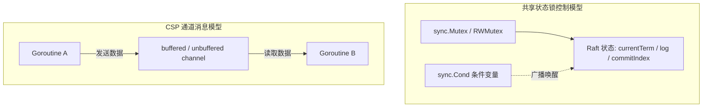
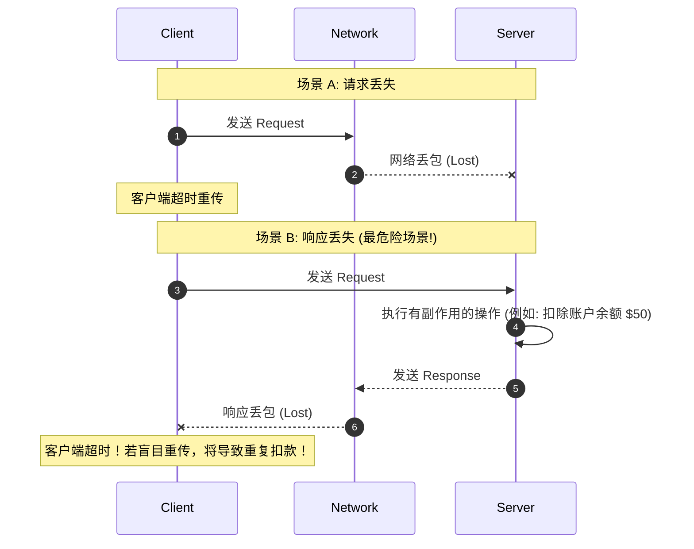

# LEC 02 - RPC 与 Go 并发编程实践

> **核心参考**：MIT 6.5840 Lecture 2 Notes, Go Concurrency Patterns, Russ Cox (Go Memory Model)  
> **核心主题**：线程并发模型 (Goroutines & Channels vs Locks)、条件变量 (Condvar)、远程过程调用 (RPC) 语义与故障语义

---

## 1. 为什么在分布式系统中使用多线程与并发？

1. **I/O 并发隐藏延迟 (I/O Concurrency)**：向远程节点发送 RPC 请求通常需要数毫秒乃至数百毫秒的物理网络往返，单线程等待会导致 CPU 处于完全饥饿状态。
2. **多核并行利用 (Multi-core Parallelism)**：充分发挥现代服务器多核硬件性能。
3. **周期性后台任务 (Periodic Maintenance)**：周期性发送心跳检测、垃圾回收、状态检查与租约续约。

---

## 2. 线程安全与并发控制陷阱

在 Go 中编写分布式系统的两套主流并发原语：
1. **共享内存与互斥锁 (Mutex & Condition Variables)**：状态机模型、Raft 核心状态保护、精确共享变量控制。
2. **通道通信 (Channels & CSP)**：流水线事件传递、通知唤醒、Worker 池任务派发。



### 经典陷阱：Condition Variable 虚假唤醒与死锁
在 Raft 实验中，必须严格在持有锁的情况下检查条件：
```go
rf.mu.Lock()
for !condition {
    rf.cond.Wait() // 自动释放锁并在唤醒后重新获取锁
}
// 执行状态修改
rf.mu.Unlock()
```

---

## 3. 远程过程调用 (RPC) 故障模型与语义

RPC 的目标是在网络之上模拟出本地函数调用的体验，但在物理网络不可靠的环境下，RPC 会面临以下故障情况：



### RPC 语义分类与工业界选型
1. **At-least-once (至少一次)**：客户端超时无限重传，直到收到应答。适用于天然**幂等 (Idempotent)** 的操作（例如读请求、覆盖写）。
2. **At-most-once (至多一次)**：服务器维护去重缓存表 (Duplicate Detection Table)，根据 `(ClientID, SequenceNumber)` 记录历史请求与结果；重传请求直接返回已记录的响应，防止副作用重复执行。
3. **Exactly-once (精确一次)**：在分布式事务与共识协议支撑下的终极理想语义。
