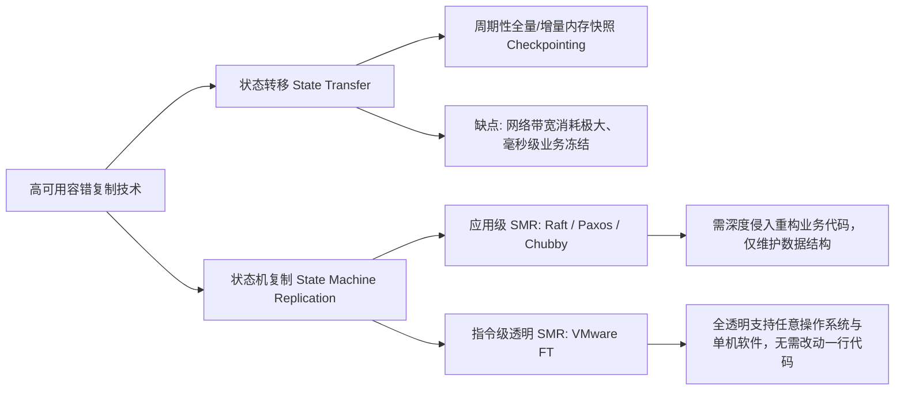
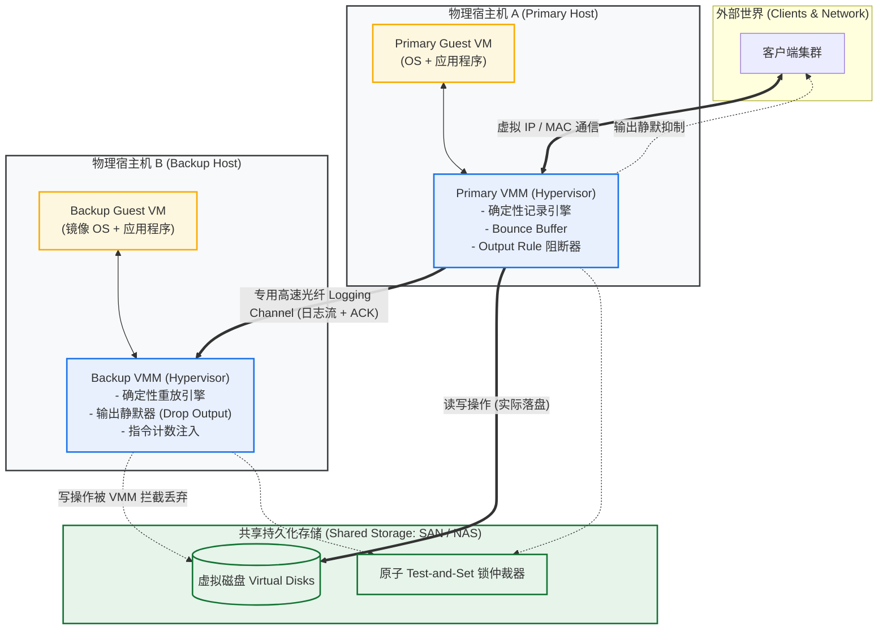
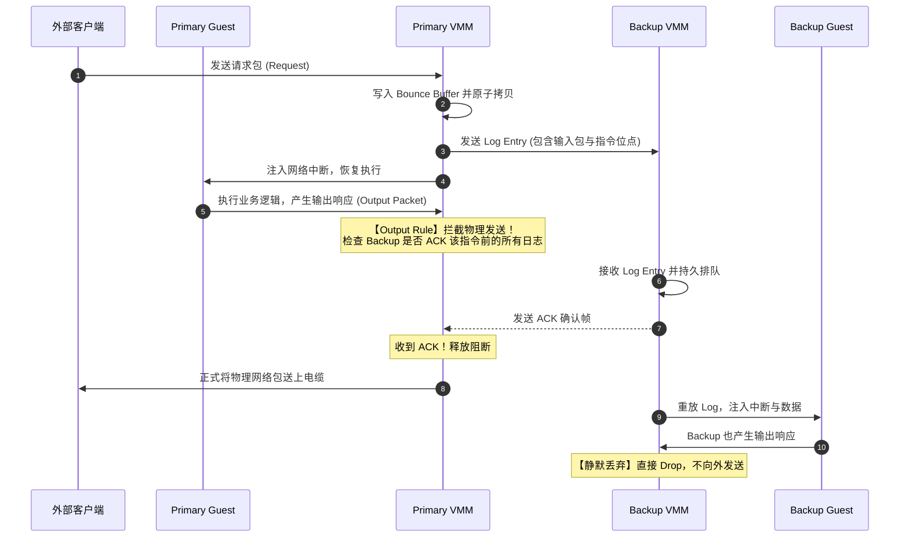
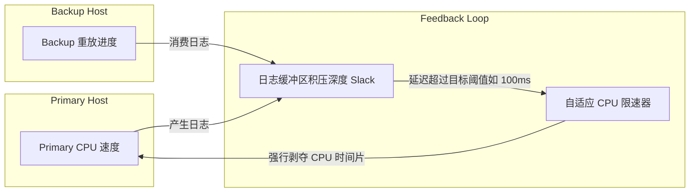

# LEC 03 - 主备复制与容错虚拟机 (VMware FT 机制深析)

> **经典论文**：*Design of a Practical System for Fault-Tolerant Virtual Machines* (Daniel J. Scales, Mike Nelson, Ganesh Venkitachalam; VMware Inc., ACM SIGOPS Operating Systems Review / ATC 2010)  
> **核心主题**：基于状态机复制 (SMR) 的指令级全透明主备复制容错系统 (Primary-Backup Replication)

---

## 1. 物理动机与设计目标

在分布式高可用系统设计中，最核心的诉求之一是实现**故障停机 (Fail-Stop) 下的业务零宕机 (Zero Downtime) 与状态零丢失 (Zero Data Loss)**。

传统的高可用方案通常分为两大流派：



### 为什么 VMware FT 具有划时代意义？
在 VMware FT 之前，大多数容错系统要求应用程序本身必须理解分布式共识（如 Paxos）。而 VMware FT 的设计目标是：
1. **完全透明 (Transparency)**：底层 Hypervisor 接管一切，Guest OS（不管是 Linux、Windows 还是闭源单机程序）对此毫感知。
2. **确定性执行 (Deterministic Execution)**：利用单核虚拟机的物理隔离，将整台虚拟机的 CPU 寄存器和 RAM 视为一个严格的确定性状态机。
3. **极低网络开销**：不复制内存本身，仅通过专用网线传输**非确定性外部事件流 (Logging Channel)**。

---

## 2. 系统核心架构全景

VMware FT 运行在两台独立的物理服务器（运行 ESXi Hypervisor）之上，划分为 Primary VM 和 Backup VM：



### 架构关键要点
1. **共享存储架构 (Shared Disk)**：
   - 虚拟磁盘并不保存在物理机本地，而是挂载在高速光纤通道或 iSCSI SAN 上。
   - **巨大优势**：主备切换时，Backup 不需要漫长的磁盘数据全量拷贝；磁盘状态由 SAN 统一保障。
   - **写操作隔离**：Primary 的磁盘写直接下发到 SAN；Backup 的磁盘写在 Hypervisor 层被静默丢弃（因为如果重放完全确定，Backup 会产生完全相同的写指令）。
2. **输入与输出分流**：
   - 外部网络流量（TCP/UDP）仅由 Primary 网卡接收。
   - Backup 的网络输出被其本地 Hypervisor **直接丢弃**，外部客户端仅看到 Primary 发出的单向响应。

---

## 3. 核心机制：消除非确定性 (Taming Non-Determinism)

状态机复制的核心数学前提是：**相同初始状态 + 相同顺序的相同确定性输入 = 绝对相同的最终状态**。

然而在现代 x86 体系结构下，CPU 的执行充满了**非确定性 (Non-deterministic Events)**。VMware FT 将其归纳为三大类，并给出了工程解法：

```mermaid
classDef cat fill:#ffffff,stroke:#1a73e8,stroke-width:2px;

graph TD
    ND[x86 非确定性来源] --> C1[1. 非确定性指令]
    ND --> C2[2. 异步硬件中断]
    ND --> C3[3. DMA 与内存并发竞态]

    C1 --> S1["【解法】Hypervisor 陷阱捕获 (Trap)<br/>记录执行结果并随 Log 同步到 Backup<br/>Backup 直接注入结果，不执行原指令"]
    C2 --> S2["【解法】硬件性能计数器 (Instruction Counter)<br/>精确记录发生中断的指令序号 $I_k$<br/>Backup 运行到精确指令 $I_k$ 触发硬件中断"]
    C3 --> S3["【解法】跳板缓冲区 (Bounce Buffer)<br/>DMA 先进入 Hypervisor 私有内存<br/>暂停 CPU 后原子拷贝入 Guest RAM 并记录点"]
```

### 3.1 非确定性指令处理
某些 x86 指令即使在相同 CPU 状态下执行，返回值也不相同：
- 读取时间戳计数器：`RDTSC` (Read Time-Stamp Counter)
- 硬件随机数生成器、CPU 序列号等。
- **机制**：Primary VMM 配置 CPU 使此类敏感指令产生异常陷阱（Trap）。VMM 读取硬件值后，将数值打包进 Log Entry 发送给 Backup，并在 Primary 恢复执行。Backup 执行到该指令时，VMM 直接将 Log 中的值写入寄存器，阻止实际硬件指令执行。

### 3.2 异步硬件中断 (Asynchronous Interrupts)
时钟中断 (Timer Interrupt) 和网卡中断的到来是随意的，可能切在任意两条汇编指令之间。如果 Primary 在第 1,000,000 条指令被中断，而 Backup 在第 1,000,005 条指令被中断，两者的线程调度和执行路径将瞬间**分道扬镳 (Diverge)**！

> [!IMPORTANT]
> **硬件性能计数器 (Performance Counters) 的妙用**：
> 现代 CPU 提供了硬件指令计数器。
> 1. Primary 捕获中断时，从硬件寄存器读出发生中断时的**精确指令计数** $I_k$。
> 2. Primary 组装日志条目：`[Interrupt Type, Instruction # = Ik]` 发送给 Backup。
> 3. Backup VMM 绝不使用宿主机的物理时钟；它配置 CPU 性能计数器，使得 CPU 在刚好执行完第 $I_k$ 条指令的瞬间触发一次 VMM 异常，并在该精确瞬间将模拟中断注入 Backup Guest OS！

### 3.3 DMA 与内存读竞态：跳板缓冲区 (Bounce Buffer)
网卡或磁盘控制器通过 DMA (Direct Memory Access) 直接向内存写数据。
- **竞态条件 (Race Condition)**：在未加防护的情况下，Guest CPU 正在读取某段内存，同时 NIC DMA 正在向同一内存段写入数据。由于微架构层面的纳秒级总线仲裁差异，Primary 可能在 DMA 完成前读到了旧数据，而 Backup 却读到了新数据，导致状态发散！
- **Bounce Buffer 机制**：
  1. Hypervisor 严禁 DMA 设备直接接触 Guest VM 物理内存。
  2. 网卡接收数据包时，DMA 只能写入 Hypervisor 的**私有跳板缓冲区 (Bounce Buffer)**。
  3. DMA 传输完成并触发中断后，VMM 暂停 Guest CPU，将数据从 Bounce Buffer 原子拷贝到 Guest 内存中，同时打上当前指令编号 $I_{dma}$。
  4. 数据内容连同 $I_{dma}$ 经由 Logging Channel 发送给 Backup。
  5. Backup 同样暂停 CPU，在指令 $I_{dma}$ 处将数据拷贝入相同内存地址，彻底杜绝内存访问竞态。

---

## 4. 输出规则 (The Output Rule) 与强一致性保障

为了对外部世界呈现单机一致性语义，系统必须保证：**如果 Primary 在产生某个输出后崩溃，接管的 Backup 必须能够重现完全相同的状态与后续输出。**

### 4.1 崩溃不一致灾难场景
假设 Primary 正在处理一条扣款事务：
1. 客户端发送 `Transfer $100`。
2. Primary 处理完毕，扣款成功，向客户端发出响应包 `Success: Balance=$900`。
3. 如果 Primary 刚刚将网络包发送出去，宿主机物理断电！
4. 此时包含该事务的 Log Entry 还卡在网络缓冲区，**没有送达 Backup**。
5. Backup 接管成为新 Primary，但它的内存状态仍然停留在扣款之前（Balance=$1000）。
6. 客户端紧接着发起查询，新 Primary 返回 `Balance=$1000`！外部世界观测到了不可逆的“时间倒流”与数据不一致。

### 4.2 输出规则协议不变量
为解决上述问题，VMware FT 制定了著名的 **Output Rule**：

> [!TIP]
> **Output Rule 定义**：
> Primary VM 在向外部物理网络发送任何输出（网络数据包或写共享磁盘）之前，必须**挂起该物理输出**，直到 Backup VM 已经**接收并确认 (ACK)** 了生成该输出之前的所有日志条目！



### 关键细节澄清
- **Primary CPU 是否被阻塞？**：不需要！Primary Guest OS 可以继续往前执行后续计算指令，VMM 只需要在网卡发射队列处把持住该特定网络包，等 ACK 到达后再放行上物理网线。
- **如果 Primary 在发出输出后立即崩溃，Backup 会重复发送吗？**
  - **可能重复发送！** Backup 接管（Go-Live）后重放未完成的输出，也会将网络包扔出来。
  - **为什么没有副作用？**
    - 针对网络包：两台虚拟机状态一致，生成的 TCP 报文拥有**完全一致的 TCP Sequence Number**。客户端的 TCP 协议栈会自动将重传包静默丢弃 (Deduplication)，上层应用丝毫不受影响。
    - 针对磁盘写：磁盘写是幂等的（相同扇区覆盖相同字节），写入两次结果完全一致。

---

## 5. 故障转移与脑裂仲裁 (Failover & Split-Brain)

当 Primary 与 Backup 之间的心跳或者 Logging Channel 失去响应时，存在两种截然不同的物理情况：
1. **真故障**：Primary 宿主机物理掉电。
2. **假故障（网络分区 / 脑裂风险）**：两台主机之间的心跳网线断开，但双方都在健康运行，且都能访问共享存储与客户端网络。

如果双方同时认为对方已死，都晋升为 Primary 并向共享磁盘写数据，会导致**灾难性的文件系统损坏与数据覆写（Split-Brain 脑裂）**。

```mermaid
flowchart TD
    Start[检测到通信中断 / 心跳丢失] --> TryLock{向共享存储发起<br/>Atomic Test-and-Set}
    
    TryLock -->|争抢成功: 获得排他锁| GoLive[晋升新 Primary (Go-Live)]
    TryLock -->|争抢失败: 锁已被占| Halt[自我终止运行 (Halt)]

    GoLive --> Step1[从静默模式切换为正常输出模式]
    Step1 --> Step2[重新下发未确认完成的飞线磁盘 I/O]
    Step2 --> Step3[通知 VMware vCenter 自动寻找新主机启动新 Backup]
```

### 共享存储的原子仲裁机制
- VMware FT 利用共享存储（SAN / NAS）提供的底层原子操作：**原子 Test-and-Set (原子锁)**。
- 磁盘服务器内部维护一个初始为 0 的标志位：
  ```c
  bool test_and_set_lock() {
      acquire_storage_lock();
      if (flag == 1) {
          release_storage_lock();
          return false; // 抢锁失败
      } else {
          flag = 1;
          release_storage_lock();
          return true;  // 抢锁成功，获得独占运行权
      }
  }
  ```
- 只有成功将标志位置为 1 的那台机器有权调用 **Go-Live** 逻辑；另一台如果抢锁失败，Hypervisor 立即将本机挂起 (Halt)。
- **如果原 Primary 活着但在分区中，它会产生危害吗？**
  - **绝对不会！** 即使原 Primary 不知道 Backup 已经上位，它后续想要向外部发送任何网络包或写磁盘，都必须满足 **Output Rule**。由于通信断开，它永远无法收到 Backup 的 ACK，其所有后续写操作都会被 Hypervisor 永久阻断！

---

## 6. 流控与缓冲滞后管理 (Logging Channel Slack)

Backup 的执行必须严格滞后于 Primary（Backup 至少需要等待一个 Log Entry 才能开始重放）。但如果 Primary 运行速度极快，产生日志的速率超过了专用网卡的物理带宽，或者 Backup 的重放 CPU 算力不足，日志队列就会无限制积压。

一旦 Primary 崩溃，如果 Backup 滞后了整整 10 秒的日志，系统将经历长达 10 秒的无服务停顿，严重损害可用性。



VMware FT 引入了动态反馈调节：
- VMM 实时统计日志滞后时间（Execution Lag）。
- 一旦 Lag 超过安全上限（例如 100ms），VMM 会通过降低 Primary 虚拟机配额（CPU Throttling）、减少时钟中断频率等方式，强行让 Primary 减速，从而给予 Backup 充足的追赶窗口。

---

## 7. 机制对比与深度反思 (Evaluation & Trade-offs)

### 7.1 VMware FT 为何不支持多核 (Multi-Processor/SMP)？
论文中明确指出，FT 在当时仅支持单核虚拟机 (Uniprocessor)。
- **多核下的物理内存交错非确定性**：在 SMP 多核架构下，两颗 CPU 核心通过共享总线和缓存一致性协议并发读写同一块内存。
- 指令的微观交错顺序取决于物理层面的电信号延迟、缓存命中率甚至温度，这在软件层面是**无法以合理成本记录与重放的**。
- 若要强行在多核下记录每次跨核内存访问冲突，系统开销将高出数个数量级（吞吐暴降 90% 以上）。直到后来的 vSphere 6.0，VMware 才改用基于密集内存快照快传（Fast Checkpoint/State Transfer）的技术来替代传统的指令级 SMR。

### 7.2 指令级 SMR 与应用级 SMR 的对比全景

| 维度 | 指令级 SMR (VMware FT) | 应用级 SMR (Raft / Paxos / Chubby) |
| :--- | :--- | :--- |
| **透明性** | **极致透明**，零代码修改，支持闭源/遗留系统 | **侵入式**，必须修改应用并重构存储状态机 |
| **复制粒度** | CPU 寄存器、指令流、硬件中断、DMA 字节 | 业务操作原语（如 `Put(k, v)`, `SQL Commit`） |
| **网络带宽消耗** | 与所有外部输入（网卡接收 + 磁盘读）成正比 | 仅与业务写操作吞吐成正比，读操作通常不占带宽 |
| **多核扩展性** | 极度困难（仅限单核或退化为 Checkpoint） | 天然优秀，由业务锁或 MVCC 并发模型控制 |
| **适用场景** | 传统政企核心单点服务、工业控制、不可修改软件 | 现代分布式数据库、分布式文件系统、云原生中台 |

---

## 8. 经典面试与机制考察 (MIT 6.5840 核心问题)

??? question "Q1: 为什么 Backup 不需要向共享磁盘执行真实的写操作？"
    **答案**：因为在完全相同的初始状态以及相同的输入流重放下，Backup 将会执行与 Primary 分毫不差的写指令（相同的数据、相同的扇区偏移）。Primary 已经将这些数据落盘到了 SAN，Backup 重复写一次不仅浪费存储带宽，而且毫无必要。因此 Backup VMM 直接将写操作静默拦截并丢弃。

??? question "Q2: 为什么 GFS 可以采用应用级复制，而 VMware FT 必须引入复杂的 Bounce Buffer？"
    **答案**：GFS 复制的是高层逻辑（Chunk 块的字节追加），Chunkserver 内部通过操作系统标准调用接收数据，不要求在精确的汇编指令级对齐；而 VMware FT 是在物理硬件指令级提供透明容错，任何内存读写在纳秒级上的微小竞态都会被 CPU 执行为不同状态，因此必须用 Bounce Buffer 将 DMA 内存变更离散化为确定性的原子拷贝。

??? question "Q3: 如果主备之间的通信断开，原 Primary 会不会向客户端返回错误的数据？"
    **答案**：不会。因为 Output Rule 规定：Primary 在发送物理网络包前，必须收到 Backup 的 ACK。一旦主备链路断开，Primary 永远得不到下一个 ACK，因此它的输出物理上被完全封死（挂起），决不可能向外部世界输出任何不一致状态。
