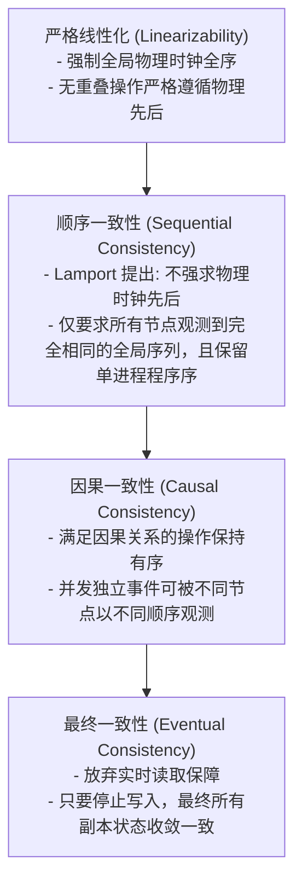

# LEC 04 - 一致性模型与线性化 (Linearizability)

> **经典文献**：*Linearizability: A Correctness Condition for Concurrent Objects* (Maurice P. Herlihy and Jeannette M. Wing, ACM TOPLAS 1990)  
> **核心工具**：Porcupine (A fast linearizability checker in Go)  
> **核心主题**：强一致性判定准则、实时重叠区间、并发读写合法判定与形式化验证

---

## 1. 为什么需要形式化的一致性模型？

在分布式系统中，“一致性 (Consistency)”是最常被滥用但也最关键的概念。一个分布式键值系统对外暴露 `Get(k)` 和 `Put(k, v)` 接口，当多个客户端在不同物理节点上并发执行读写时，什么样的返回结果是“合法的”？

如果不加严格限制，系统可能会出现：
- 读到旧数据（Stale Read）。
- 时间倒流：客户端先读到了新值 $v_2$，后续的读操作反而读回了旧值 $v_1$。
- 观察因果逆转：客户端 A 观测到事件 X 先于 Y 发生，客户端 B 却观测到 Y 先于 X 发生。

---

## 2. 线性化 (Linearizability / Strong Consistency) 的定义

线性化是分布式系统能提供的最强单对象一致性保障（通常也称**强一致性**）。

> [!IMPORTANT]
> **线性化的三大核心判定法则**：
> 1. **原子生效点 (Linearization Point)**：每个操作虽然在物理上跨越一段耗时区间（从请求发起调用 `inv` 到收到响应返回 `resp`），但其逻辑生效效果必须在调用与响应之间的某一个离散时间点 $t_{linear}$ 瞬间完成。
> 2. **真实时间顺序约束 (Real-Time Order)**：如果操作 $op_1$ 的响应时间物理上早于操作 $op_2$ 的发起时间（即 $resp(op_1) < inv(op_2)$，两者无重叠），那么在全局逻辑序列中，$op_1$ **必须**排在 $op_2$ 之前！
> 3. **串行合法性 (Sequential Specification)**：将所有并发操作按各自的原子生效点排序后形成的全局单线程操作序列，必须完全符合该数据结构的单机串行语义。

```mermaid
gantt
    title 线性化时间轴与操作区间分析
    dateFormat X
    axisFormat %s
    section Client 1
    Put(x, 1) :done, c1, 0, 40
    section Client 2
    Get(x)->1 :active, c2, 35, 70
    section Client 3
    Get(x)->0 :crit, c3, 45, 80
```

### 违背线性化案例分析（如上甘特图）
- `Put(x, 1)` 在时间 $t=40$ 完成并收到响应。
- `Client 3` 在时间 $t=45$ 发起 `Get(x)`。因为 $t=45 > t=40$，`Get(x)` 与 `Put(x, 1)` 在真实物理时间上**没有任何重叠**。
- 如果 `Client 3` 返回了旧值 `0`，则该系统**违背了线性化**！因为后续操作没有观测到在物理时间上已完成的前置写操作。

---

## 3. 一致性光谱对比 (Consistency Spectrum)

