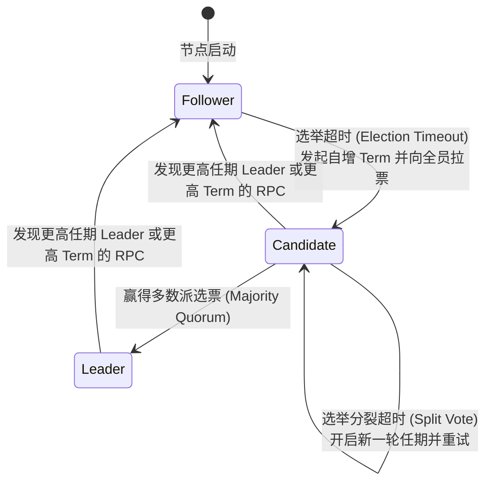

# LEC 05 - Raft 共识算法核心与选主机制 (Part 1)

> **经典论文**：*In Search of an Understandable Consensus Algorithm (Extended Version)* (Diego Ongaro and John Ousterhout, Stanford University, USENIX ATC 2014)  
> **核心主题**：强领导者模型 (Strong Leader)、任期代数 (Terms)、随机化选举超时 (Randomized Timers)、多数派法定人数 (Quorum) 与安全性不变量

---

## 1. 为什么 Paxos 难以在工业界实现？

在 Raft 提出之前，Leslie Lamport 的 Paxos 几乎是分布式共识领域的唯一标准。然而工业界团队在工程实践中发现：
1. **概念极度抽象难懂**：Paxos 将一致性分为 Synod、Multi-Paxos，缺乏直观的运行状态机隐喻。
2. **工程实现极其痛苦**：Paxos 论文遗留了大量实际工程空白（如日志压实、成员动态变更、客户端防重、Leader 租约等），导致“有成百上千种 Paxos 变种，但没有一种通用标准”。

Raft 的核心目标是：**可理解性 (Understandability)**。通过将共识问题分解为清晰独立的子模块：
- **Leader 选举 (Leader Election)**
- **日志复制 (Log Replication)**
- **安全性保障 (Safety Invariants)**

---

## 2. 节点角色与状态转移机

在任意时刻，每个 Raft 节点处于以下三种角色之一：

### 关键角色语义
1. **Follower (跟随者)**：完全被动。只响应来自 Candidate 和 Leader 的 RPC。如果长时间没有收到心跳，触发选举超时。
2. **Candidate (候选人)**：主动发起竞选。增加本地任期编号 `currentTerm`，投自己一票，并向其他所有节点并行发送 `RequestVote` RPC。
3. **Leader (领袖)**：负责处理客户端所有读写请求。全权管理日志追加、分发并向 Follower 周期性广播心跳 (`AppendEntries` 空负载帧) 抑制选举。

---

## 3. 随机化选举超时与选票分裂 (Split Votes) 破解

如果多个 Follower 同时超时并发起竞选，可能会出现平票僵局（例如 5 个节点中节点 A 得 2 票，节点 B 得 2 票，节点 C 得 1 票，没有任何节点获得超过半数的 3 票）。

> [!TIP]
> **Raft 的破解之道：随机化超时时间 (Randomized Election Timeouts)**：
> Raft 将选举超时时间设定在一个随机区间内（例如 $150\text{ms} \sim 300\text{ms}$）。由于节点超时时间被随机打散，通常只有**一个**节点最先苏醒并发起拉票，在其他节点超时之前迅速集齐多数派选票，将平票概率降至极低。

---

## 4. 选主限制 (Election Restriction)

Raft 严格保证一个核心安全性定理：**Leader 完整性 (Leader Completeness Property)**。
如果一条日志在某个 Term 被成功 Commit，那么这条日志必然存在于未来所有更高 Term 的 Leader 的本地日志中！

实现该特性的核心准则在 `RequestVote` 中：
投票者若收到 Candidate 的拉票请求，只有在 Candidate 的日志**至少和自己一样新 (At least as up-to-date)** 时，才同意投票：
1. **Term 比较**：Candidate 最后一条日志的 Term 必须大于投票者最后一条日志的 Term。
2. **Index 比较**：如果两者最后一条日志的 Term 相同，Candidate 的日志长度（最后一条日志的 Index）必须大于或等于投票者的日志长度。
