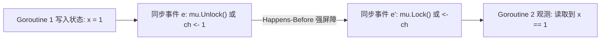

# LEC 06 - 现代分布式 Go 编程范式

> **特邀讲座**：Russ Cox (Google Go 核心架构师) - *The Go Programming Language and Environment* (ACM CACM 2022)  
> **核心主题**：Go 语言内存模型 (Memory Model)、Happens-Before 关系、高并发分布式工程陷阱与性能优化

---

## 1. 为什么 Go 是分布式系统的主流工程语言？

在现代云原生与分布式计算基建领域（Docker、Kubernetes、etcd、CockroachDB、TiKV Client），Go 占据绝对统治地位：
1. **轻量级轻协程 (Goroutines)**：极小的栈开销（初始 2KB 动态伸缩），单机可支撑数十万并发执行单元。
2. **高效的内置通道 (Channels & Select)**：使得异步事件驱动与超时控制代码极具表现力。
3. **极速编译与单静态二进制分发**：彻底免去动态库版本地狱，天然适配容器化交付。

---

## 2. Go 内存模型与 Happens-Before 原则

分布式程序员最容易犯的错误是：**假设多线程读写未加锁变量时能看到即时修改**。
在现代 CPU 乱序执行与多级缓存体系下，如果不使用同步原语，内存写入可能永远对其他 Goroutine 不可见。



### 关键并发陷阱：闭包捕获循环变量
在 Go 1.22 之前，并发调度循环中的变量捕获是极为隐蔽的 Bug 源头：
```go
// 错误写法：所有 goroutine 捕获同一个循环变量引用
for _, peer := range peers {
    go func() {
        sendRPC(peer) // 最终发送的可能全为最后一个 peer！
    }()
}

// 正确写法：局部形参拷贝传递
for _, peer := range peers {
    go func(p Peer) {
        sendRPC(p)
    }(peer)
}
```
