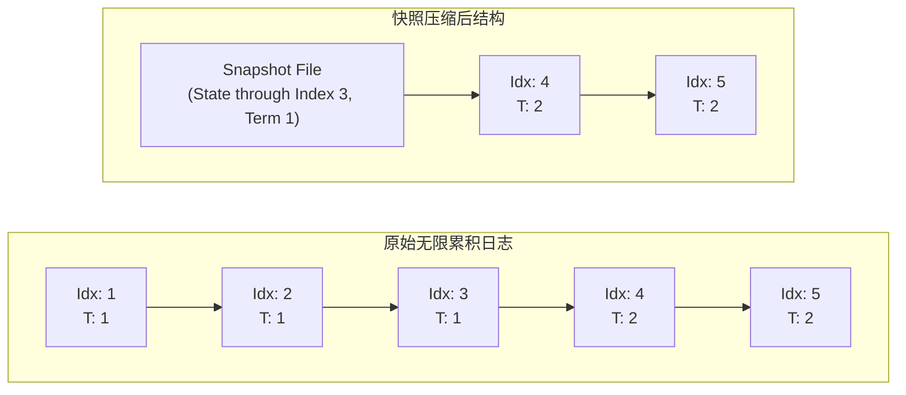

# LEC 07 - Raft 日志压缩与持久化状态 (Part 2)

> **经典论文**：*In Search of an Understandable Consensus Algorithm (Extended Version)* Section 7-8 (Ongaro & Ousterhout, 2014)  
> **核心主题**：持久化状态 (Persistent State)、故障崩溃恢复 (Crash Recovery)、日志压缩 (Log Compaction) 与快照同步 (`InstallSnapshot`)

---

## 1. 持久化状态 (Persistence)

在实际生产集群中，机器随时可能发生掉电或崩溃重启。为了保证重启后不破坏已达成的共识安全性，Raft 节点必须将部分关键状态实时刷盘保存到非易失性存储 (Non-volatile Storage)：

```mermaid
classDef persist fill:#fce8e6,stroke:#ea4335,stroke-width:2px;
classDef volatile fill:#e8f0fe,stroke:#1a73e8,stroke-width:2px;

graph TD
    subgraph Persistent["必须持久化刷盘状态 (崩溃重启后读取)"]
        T["currentTerm (当前任期)"]:::persist
        V["votedFor (该任期投给谁)"]:::persist
        L["log[] (日志条目数组)"]:::persist
    end

    subgraph Volatile["易失内存状态 (崩溃重启后重置)"]
        CI["commitIndex (已提交最高位)"]:::volatile
        AI["lastApplied (已应用最高位)"]:::volatile
        NI["nextIndex[] (Leader 视角)"]:::volatile
        MI["matchIndex[] (Leader 视角)"]:::volatile
    end
```

### 为什么 `votedFor` 必须持久化？
如果一个节点在任期 1 投票给了候选人 A，随后该节点掉电重启。若没有将 `votedFor` 写入磁盘，重启后它可能会在同一个任期 1 再次将票投给候选人 B！
这将直接导致同任期内出现**两个合法 Leader**，引发毁灭性的脑裂数据覆盖。

---

## 2. 日志压缩与快照 (Log Compaction)

一个长久运行的分布式系统，日志不能无限增长（否则内存将耗尽，且节点重启后重放日志的耗时将无法承受）。

Raft 采用**状态机快照 (Snapshotting)** 机制：
- 应用程序状态机将当前内存状态（例如键值对全量字典）固化并输出为快照文件。
- Raft 丢弃该快照所覆盖的索引之前的所有历史日志条目。
- 保留元数据：`lastIncludedIndex` 与 `lastIncludedTerm`，用于在后续日志追加时维持连续性校验。



---

## 3. 落后节点的快照同步 (`InstallSnapshot` RPC)

当一个 Follower 极度落后（例如断网数小时后重新入网），Leader 本地早已将 Follower 所需的日志条目压缩丢弃。
此时 Leader 无法通过普通的 `AppendEntries` 补全日志，必须调用 `InstallSnapshot` RPC 直接将整个状态机快照文件传输给 Follower，助其直接跳跃到最新状态基线。
