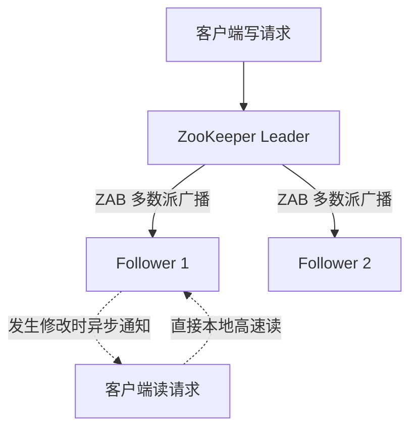

# LEC 09 - ZooKeeper 分布式协同与无锁读

> **经典论文**：*ZooKeeper: Wait-free coordination for distributed systems* (Patrick Hunt, Mahadev Konar, Flavio P. Junqueira, Benjamin Reed; Yahoo! Research, USENIX ATC 2010)  
> **核心主题**：分层命名空间 (Hierarchical Tree)、ZAB 协议、Wait-Free 客户端无锁读、Watch 事件通知与分布式锁实现

---

## 1. 为什么需要通用协同服务？

在分布式集群中，不同的分布式系统（如 HBase、Kafka、Storm）都需要解决以下通用诉求：
- Master 节点动态选举
- 集群配置参数集中管理与动态推送
- 服务发现与健康心跳维护
- 分布式锁与跨节点栅栏同步

ZooKeeper 的核心突破在于：**不直接在内核中实现复杂的分布式锁原语，而是暴露出一个类似文件系统层级命名空间的极简树状 API，让用户在其上自行拼装高层协调机制。**

---

## 2. 读写性能的分离设计：Wait-free 客户端读

传统共识系统要求所有读操作也必须走 Quorum 共识，导致读吞吐受到严重制约。
ZooKeeper 的核心设计：
1. **写操作强一致性**：所有写请求由 Leader 统一编号并通过 ZAB (ZooKeeper Atomic Broadcast) 协议同步到多数派节点。
2. **读操作本地化 (Local Read)**：客户端可以连接集群中任意 Follower 直接读取内存数据，实现数万 QPS 的超高读吞吐。
   - **代价**：读请求可能读到略微陈旧的数据 (Stale Data)。
   - **补救机制**：引入 `sync()` 系统调用，强制 Follower 将读取指针推进到与 Leader 同步的位点；配合 **Watch 机制**，当数据节点发生变化时，服务端主动向客户端发送异步通知。

