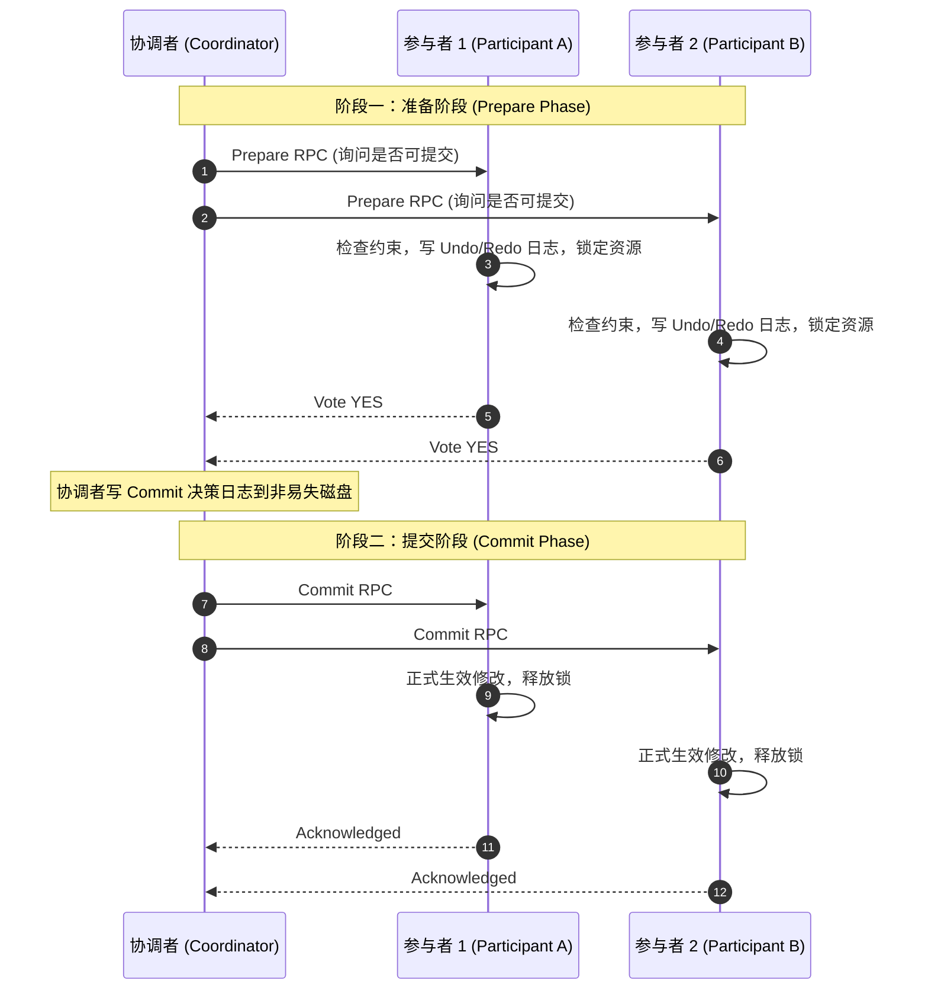

# LEC 10 - 分布式事务与两阶段提交 (2PC)

> **经典文献**：MIT 6.033 Chapter 9: Atomicity across computers  
> **核心主题**：ACID 特性、两阶段提交协议 (Two-Phase Commit, 2PC)、协调者单点阻塞问题与 Paxos-backed 2PC 演进

---

## 1. 跨节点原子提交 (Atomic Commit Problem)

在分布式数据库中，一个转账事务往往涉及跨物理分区的多个节点：
$$\text{Transfer}(A \to B, \$100): \quad \text{Node}_1: A \leftarrow A - 100, \quad \text{Node}_2: B \leftarrow B + 100$$

系统必须保证**原子性 (Atomicity)**：要么所有节点全部提交 (Commit)，要么所有节点全部回滚 (Abort)，绝不能出现一方扣款而另一方未入账的不一致中间态。

---

## 2. 两阶段提交 (2PC) 协议执行流

### 2PC 的致命缺陷：阻塞性 (Blocking Protocol)
- 如果参与者投了 `Vote YES`，它便进入了 **Prepared 状态**。在此状态下，参与者既不能单方面提交（因为另一个参与者可能投了 NO），也不能单方面回滚（因为协调者可能已经做出了 Commit 决策）。
- **如果协调者此时物理崩溃**：所有参与者必须无限期持有数据锁处于等待阻塞状态，导致该资源上的其他并发事务全部卡死。
- **工业界现代化解法**：使用多副本共识组（如 Raft/Paxos）来担当协调者与参与者角色（如 Spanner、CockroachDB），消除协调者的单点崩溃风险。
