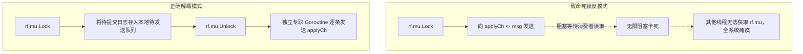

# LEC 11 - Raft 实验实现难点与答疑 (Lab 3 Q&A)

> **核心参考**：MIT 6.5840 Staff Guidance, Students' Common Pitfalls  
> **核心主题**：竞态条件检测 (-race)、死锁防护、RPC 延迟重放、ApplyChannel 阻塞与心跳活锁排查

---

## 1. 实验调试核心心法

在 MIT 6.5840 的 Raft 实验中，最令人痛苦的是各种偶发的并发竞态与死锁问题。

### 黄金调试原则：
1. **永远使用 `-race` 检测工具**：`go test -race -run 3A`，任何并发读写未加锁都会被精确报告。
2. **禁止在持有锁的情况下调用外部阻塞操作**：
   - 严禁在持有 `rf.mu` 的时候调用 `rf.peers[i].Call()` 发起 RPC！如果网络丢包或对端迟钝，该 Goroutine 将阻塞数秒，导致其他 Goroutine 全部被死锁在锁排队上。
3. **正确将日志应用到状态机**：
   - `applyCh` 管道的消费速度可能很慢。如果在持有锁的情况下向非缓冲管道发送，会形成致命的循环等待死锁。

