# LEC 12 - Google Spanner 与 TrueTime 外部一致性

> **经典论文**：*Spanner: Google’s Globally-Distributed Database* (James C. Corbett et al., Google Inc., OSDI 2012)  
> **核心主题**：全球分布式数据库、TrueTime API、不确定性区间 $\pm\epsilon$、Commit Wait 与外部一致性 (External Consistency / Strict Serializability)

---

## 1. 外部一致性 (External Consistency) 与物理时钟困境

传统分布式事务往往只能在单个数据中心内实现可串行化。当事务跨越全球各大洲数据中心时，如何保证：**如果事务 $T_2$ 在事务 $T_1$ 提交完成之后才发起，那么 $T_2$ 分配到的全局提交时间戳必然大于 $T_1$ 的时间戳 ($s_2 > s_1$)？**

如果在普通服务器上使用 NTP (Network Time Protocol) 对时，不同机房间的时钟偏差可能高达数十毫秒甚至数百毫秒，导致晚发生的事务被盖上较小的时间戳，破坏因果顺序。

---

## 2. 破局：TrueTime API 硬件时钟区间

Google 为每个数据中心部署了 GPS 授时接收器与原子钟 (Atomic Clocks)。

TrueTime API 暴露的核心接口返回一个时间区间而非单一时间点：
$$\text{TT.now}() = [t.earliest, \, t.latest] \quad (\text{误差界限 } \epsilon \approx 1 \sim 7\text{ms})$$

```mermaid
gantt
    title TrueTime 硬件时钟误差区间与 Commit Wait
    dateFormat X
    axisFormat %s
    section 事务 T1 执行
    本地准备提交, 取 TT.now() :done, p1, 0, 20
    section Commit Wait 强制等待 2*epsilon
    强制等待直至 t.earliest > s1 :crit, cw, 20, 50
    section 对外暴露结果
    释放读写锁，响应客户端 :active, rel, 50, 70
```

### Commit Wait 规则
事务 $T_1$ 选择一个提交时间戳 $s_1 = \text{TT.now}().\text{latest}$。
Leader 必须**强制等待**一段时间，直到满足：
$$\text{TT.now}().\text{earliest} > s_1$$
只有在此之后，才允许正式提交并向客户端释放数据锁。这保证了无论世界上任何其他节点在此时发起新事务 $T_2$，其读取到的时间绝对不可能早于 $s_1$！
