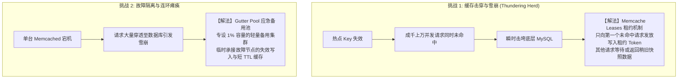

# LEC 16 - 大规模缓存一致性 (Facebook Memcached)

> **经典论文**：*Scaling Memcache at Facebook* (Rajesh Nishtala et al., Facebook Inc., NSDI 2013)  
> **核心主题**：十亿级用户架构、Cache-Aside 模式、Thundering Herd (惊群效应)、Lease 租约防击穿与跨 Region 复制一致性

---

## 1. 规模驱动的极端架构演进

Facebook 的工作负载以极端的**读多写少 (Read-heavy)** 为主（例如读取个人主页内容、好友关系链与消息通知）。
单体数据库在数千万 QPS 面前将瞬间崩溃，因此系统全面采用 **Memcached 分布式内存缓存层** 阻挡 99% 以上的数据库读流量。

---

## 2. 核心挑战与精妙解法

### 3. 跨 Region 一致性保障
跨大洋不同机房之间存在数十毫秒的光纤延迟。写操作全部路由到 Master Region 并在提交后，通过 MySQL 复制流 (McSqueal) 异步发送无效化指令 (Invalidate) 清除各 Slave Region 的本地缓存，避免脏读扩散。
