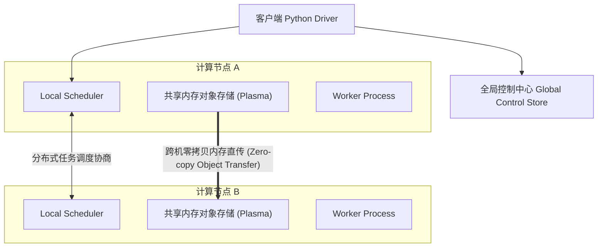

# LEC 19 - 分布式 AI 与计算调度引擎 (Ray)

> **经典论文**：*Ray: A Distributed Framework for Emerging AI Applications* (Philipp Moritz, Robert Nishihara, Ion Stoica et al., UC Berkeley, OSDI 2018 / 2021)  
> **核心主题**：动态计算图 (Dynamic Task Graph)、分布式对象存储 (Plasma)、Actor 与 Task 混合编程模型与百万级高并发任务调度

---

## 1. 为什么传统分布式计算框架无法适配现代 AI 工作流？

传统的 MapReduce、Spark 面向批处理，假设计算图是静态的、粗粒度的。
而现代机器学习与大语言模型 (LLM) 训练/推理场景具有全新的特征：
- 细粒度、动态生成的计算任务图 (Dynamic DAG)。
- 混合执行模型：既有无状态的纯函数式计算 (Stateless Tasks)，又有维护大模型显存权重/KV Cache 的有状态实体 (Stateful Actors)。
- 极高的跨节点超大张量与参数张量共享吞吐。

---

## 2. Ray 的双层去中心化调度架构

- **Bottom-Up 调度策略**：任务先由本节点的 Local Scheduler 评估；若资源充足直接本地派发，消除中心调度器的单点吞吐瓶颈。
- **Plasma 共享内存**：同一物理机内的多个 Worker 进程通过内存映射 (`mmap`) 零拷贝访问巨大张量数据，极大提升数据传输吞吐。
