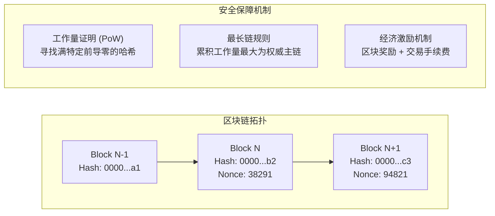

# LEC 21 - 点对点网络与比特币中本聪共识

> **经典论文**：*Bitcoin: A Peer-to-Peer Electronic Cash System* (Satoshi Nakamoto, 2008)  
> **核心主题**：非许可制点对点网络 (Permissionless P2P)、工作量证明 (Proof-of-Work)、最长链规则 (Longest-Chain Rule) 与双花攻击防护 (Double-Spending)

---

## 1. 经典拜占庭容错与无许可共识的鸿沟

传统的 BFT 协议（如 PBFT）要求预先知道集群的所有节点数量 $N$，并通过两阶段/三阶段的全员消息广播 ($O(N^2)$ 复杂度) 达成决议。这在完全开放、任何人皆可自由加入/离开的互联网公网上完全失效（会遭受海量虚假节点伪造身份的**女巫攻击 Sybil Attack**）。

中本聪的破局思想：**One-CPU-One-Vote (算力即投票权)**。

---

## 2. 中本聪共识的三大基石

### 为什么需要 6 个确认区块？
由于存在跨大洲网络传播延迟，区块链可能临时产生偶发分叉。随着诚实算力在其中一条链上继续累积 PoW 工作量，恶意攻击者若想暗中构建另一条分叉链实施双花，其算力必须超过全网算力的 51% 才能实现追赶反超。在诚实算力占多数的前提下，等待 6 个区块后交易被篡改回滚的概率收敛至指数级趋近于 0。
