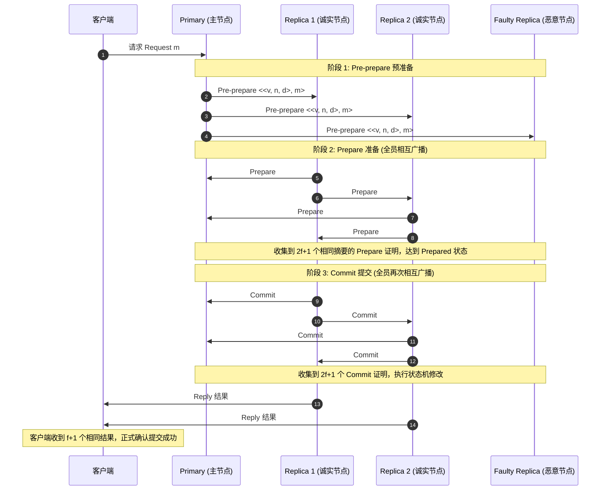

# LEC 22 - 实用拜占庭容错算法 (PBFT)

> **经典论文**：*Practical Byzantine Fault Tolerance* (Miguel Castro and Barbara Liskov, MIT LCS, OSDI 1999)  
> **核心主题**：拜占庭故障模型 (Byzantine Failures)、恶意节点伪造攻击、$3f+1$ 容错下界与三阶段协议 (Pre-prepare / Prepare / Commit)

---

## 1. 拜占庭故障模型 (Byzantine Failures)

在前面的课程中（Raft、GFS、VMware FT），我们默认假设节点属于 **Fail-Stop** 模型：节点可能崩溃、失联或重启，但**绝不会故意伪造数据或发送谎言**。
而在不可信环境或关键金融设施中，恶意软件或黑客可以控制某些节点执行**任意恶意行为 (Arbitrary / Byzantine Behaviors)**：
- 向节点 A 说“批准提交”，同时向节点 B 说“拒绝提交”。
- 随意篡改历史消息内容。
- 选择性截断并丢弃消息。

---

## 2. 为什么需要 $3f+1$ 个总节点来容忍 $f$ 个拜占庭故障？

假设集群总共有 $N$ 个节点，最多有 $f$ 个节点可能是恶意的。
1. **可用性要求 (Liveness)**：因为最多有 $f$ 个节点可能直接死掉并不回复任何消息，系统在收到 $N - f$ 个节点的响应后必须能够继续推进，不能无限等待。
2. **安全性要求 (Safety)**：在这 $N - f$ 个已收到的回复中，极端情况下可能包含全部 $f$ 个恶意节点的谎言回复。因此，真正的诚实节点回复只有 $(N - f) - f = N - 2f$ 个。
3. 为了形成压倒性的真实多数派，诚实节点的有效票数必须严格大于恶意节点的票数：
$$N - 2f > f \implies N > 3f \implies N_{\min} = 3f + 1$$

---

## 3. PBFT 三阶段协议流

