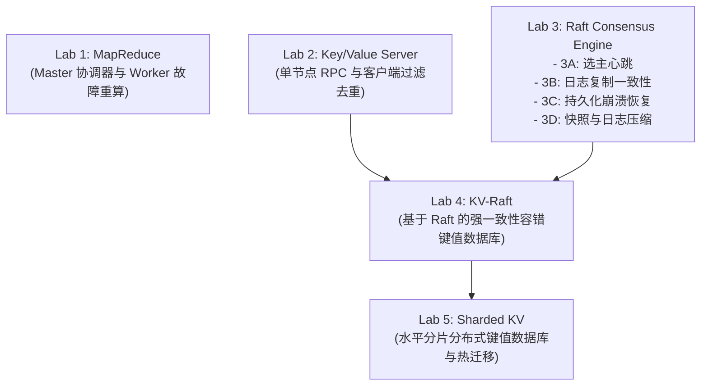

# 附录 B - MIT 6.5840 核心实验通关指南

MIT 6.5840 实验体系是全球最负盛名的分布式系统动手工程项目。本附录为各个 Lab 提供架构脉络与避坑总览。

---

## 实验概览与依赖拓扑

---

## 各 Lab 核心设计与防坑指北

### Lab 1: MapReduce
- **核心目标**：实现无状态 Worker 进程与单 Master 调度器。
- **高频陷阱**：Worker 在写中间文件时必须先写入临时文件，写入成功后再原子重命名为目标文件，避免 Worker 崩溃导致 Reduce 读到半写截断的残损文件。

### Lab 2: Key/Value Server
- **核心目标**：实现带有 At-most-once 语义的可靠键值 RPC 协议。
- **高频陷阱**：重传 RPC 必须依据 `(ClientID, SequenceNumber)` 命中去重表并返回历史结果，不可重复执行非幂等的 `Append(key, val)`。

### Lab 3: Raft 共识引擎
- **3A 选主**：使用随机化定时器（$250\sim 400\text{ms}$），心跳间隔约为 $100\text{ms}$。
- **3B 日志**：加速日志冲突回退（Accelerated Log Backtracking），让 Leader 快速跳过整批冲突任期的日志。
- **3C 持久化**：凡是修改了 `currentTerm`、`votedFor` 或追加了 `log`，必须在释放锁之前同步调用 `persist()`。
- **3D 快照**：处理快照与日志裁剪的边界索引偏移，避免数组越界。

### Lab 4: KV-Raft
- **核心目标**：将应用层状态机与底层的 Raft 库结合，处理并发读写与切主场景下的重定向。

### Lab 5: Sharded KV
- **核心目标**：实现带有分片控制器 (Shard Controller) 的分布式多副本数据库，支持在不同 Raft 复制组之间平滑迁移分片所有权。
