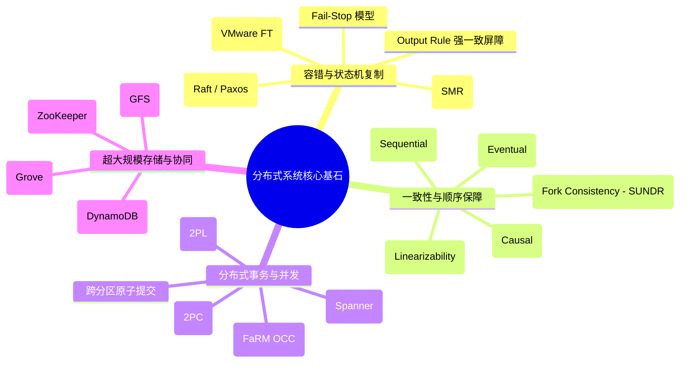

# 分布式系统精读笔记 (MIT 6.5840 / 6.824)

欢迎查阅 **MIT 6.5840: Distributed Systems (Spring 2025)** 机制级精读笔记与知识全景指南。

本知识库旨在拆解现代分布式系统设计的底层物理约束、核心数学模型、复制与一致性协议、跨节点事务机制，以及工业界超大规模基础设施的架构权衡。

---

## 核心设计哲学 (Core Pillars)

分布式系统本质上是在不可靠的网络和硬件之上，构建出具备**可用性 (Availability)**、**强一致性 (Consistency)** 与**容错能力 (Fault Tolerance)** 的抽象系统。全书围绕四大核心基石展开：

---

## MIT 6.5840 (Spring 2025) 课程全景大纲

| 阶段 | 讲次 | 核心主题 | 经典论文 / 研读材料 | 关键机制与挑战 |
| :--- | :--- | :--- | :--- | :--- |
| **阶段一** | **LEC 01** | [导论与 MapReduce](01_intro_mapreduce.md) | Dean & Ghemawat (2004) | 大规模容错并行计算、Worker 故障重算机制 |
| | **LEC 02** | [RPC 与 Go 并发编程](02_rpc_threads_go.md) | Go Concurrency / Crawler | 锁竞争、Condition Variables、RPC At-least-once 语义 |
| **阶段二** | **LEC 03** | [主备复制与容错虚拟机](03_vm_ft_replication.md) | **VMware FT (Scales et al. 2010)** | 指令计数器、Bounce Buffer、Output Rule、脑裂仲裁 |
| | **LEC 04** | [一致性与线性化](04_linearizability.md) | Linearizability Testing | 实时重叠区、并发判定准则、Porcupine 线性化验证 |
| **阶段三** | **LEC 05** | [Raft 共识：选主与日志](05_raft_part1.md) | Ongaro & Ousterhout (2014) | Randomized Timers、Majority Quorum、Leader Completeness |
| | **LEC 06** | [Go 语言工程最佳实践](06_go_patterns.md) | Russ Cox (Google) | 高并发通道设计、内存模型与同步原语工程陷阱 |
| | **LEC 07** | [Raft 共识：快照与持久化](07_raft_part2.md) | Raft Extended §7-8 | Log Compaction、InstallSnapshot RPC、Crash Recovery |
| | **LEC 11** | [Raft 实验疑难深度解析](11_raft_qa.md) | 6.5840 Staff Lab Q&A | 活锁竞选、RPC 乱序延迟、ApplyChannel 死锁避坑 |
| **阶段四** | **LEC 08** | [GFS 分布式文件系统](08_gfs.md) | Ghemawat et al. (2003) | 单 Master 瓶颈破局、Chunk 重复与失序追加、Lease 租约 |
| | **LEC 09** | [ZooKeeper 协同服务](09_zookeeper.md) | Hunt et al. (2010) | ZAB 协议、Wait-free 客户端读、Watch 机制与分布式锁 |
| **阶段五** | **LEC 10** | [分布式事务与 2PC](10_distributed_tx_2pc.md) | 6.033 Chapter 9 | Coordinator 单点故障、Prepared 阻塞态、Paxos 强化提交 |
| | **LEC 12** | [Google Spanner](12_spanner_truetime.md) | Corbett et al. (2012) | TrueTime 硬件时钟区间 $\pm\epsilon$、Commit Wait、外部一致性 |
| | **LEC 13** | [FaRM 极速并发控制](13_farm_occ_rdma.md) | Dragojević et al. (2015) | 单边 RDMA、NVRAM 故障恢复、乐观并发控制 (OCC) 验证 |
| | **LEC 14** | [Chardonnay 云原生事务](14_chardonnay.md) | Eldeeb et al. (OSDI '23) | 基于全局时间戳的云原生解耦式分析型事务引擎 |
| **阶段六** | **LEC 15** | [Grove 系统形式化验证](15_grove_verification.md) | Sharma et al. (2023) | Iris 分离逻辑、Go 语言实现形式化无 Bug 证明 |
| | **LEC 16** | [Facebook Memcached](16_memcached_fb.md) | Nishtala et al. (2013) | Gutter Pool、Lease 缓存击穿防护、跨 Region 最终一致 |
| | **LEC 17** | [Amazon DynamoDB](17_dynamodb.md) | Idziorek et al. (ATC '23) | 存储与日志解耦、Paxos 复制组自适应流控与跨行事务 |
| | **LEC 18** | [AWS Lambda 容器按需加载](18_aws_lambda.md) | Brooker et al. (ATC '23) | 树形分块按需拉取、快照恢复、极低延迟冷启动 |
| | **LEC 19** | [Ray 分布式 AI 计算引擎](19_ray.md) | Moritz et al. (2021) | 任务图拓扑调度、分布式内存对象存储 (Plasma) |
| **阶段七** | **LEC 20** | [SUNDR 分叉一致性](20_sundr.md) | Li et al. (2004) | 恶意未受信任服务器、Fork Consistency 隔离与检测 |
| | **LEC 21** | [Bitcoin 中本聪共识](21_bitcoin.md) | Nakamoto (2008) | 工作量证明 (PoW)、最长链规则、女巫攻击防护 |
| | **LEC 22** | [PBFT 拜占庭容错](22_pbft.md) | Castro & Liskov (1999) | 三阶段协议 (Pre-prepare, Prepare, Commit)、$3f+1$ 容错边界 |

---

## 实验通关体系 (Hands-on Labs)

课程配套了业界最为硬核的分布式系统通关实验：

1. **Lab 1: MapReduce** —— 实现分布式 Map/Reduce 调度器与协调节点 (Coordinator)，处理 Worker 崩溃与任务超时重启。
2. **Lab 2: Key/Value Server** —— 单机 RPC 存储服务，实现 At-least-once / At-most-once 过滤去重与租约同步。
3. **Lab 3: Raft Consensus Engine**
   - **3A**: Leader 选主与心跳检测 (`RequestVote`)。
   - **3B**: 日志复制与一致性检查 (`AppendEntries`)。
   - **3C**: 故障恢复与持久化状态 (`Persist` / `readPersist`)。
   - **3D**: 日志快照与空间压缩 (`Snapshot` / `InstallSnapshot`)。
4. **Lab 4: Fault-tolerant Key/Value Service (KV-Raft)** —— 基于 Raft 构建线性化容错键值集群，解决重复 RPC、网络分区与切主丢请求。
5. **Lab 5: Sharded Key/Value Service** —— 实现带分片控制器 (Shard Controller) 的水平分片分布式键值数据库，支持无缝热分片迁移与跨分片配置演进。

---

## 如何研读与贡献

- 文档支持按阶段从浅入深阅读，左侧导航栏分类呈现核心讲义，点击右上角可一键切换深色模式。
- 每篇笔记严格遵循统一结构：**背景与物理动机 $\to$ 架构与协议状态机 $\to$ 核心不变量与安全性证明 $\to$ 故障恢复与边界 Case $\to$ 工业界落地演进**。
